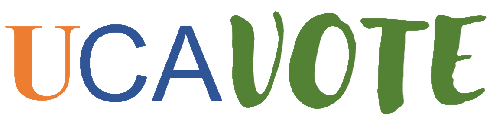

Es una aplicación destinada a la digitalización de los procesos electorales de la **UCA**. Se entiende que si está usted haciendo uso de ella, pertenece a la comunidad
universitaria, y que en principio estará familiarizado con la tediosa idiosincrasia de estos eventos. Siguiendo el siguiente manual verá como de una forma sencilla, ahorrará tiempo y
le liberará de dolores de cabeza innecesarios para la fecha en la que es.

<a href="https://ucavote.000webhostapp.com/"> Volver a UCAVOTE</a>
