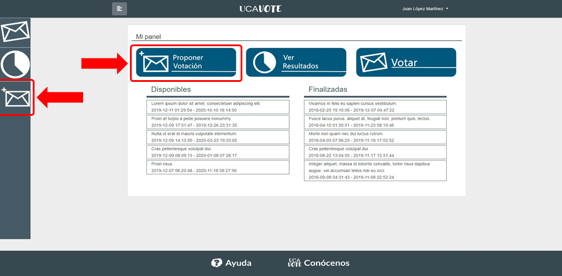
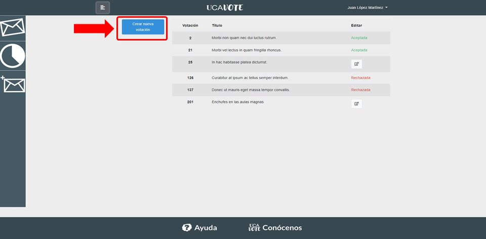
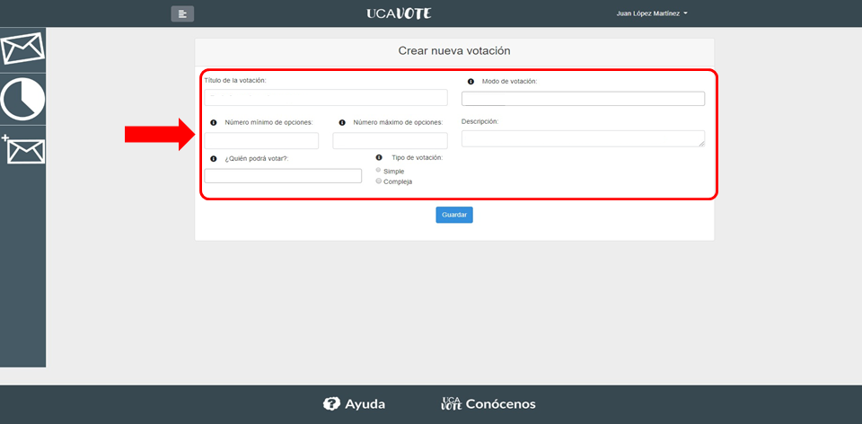
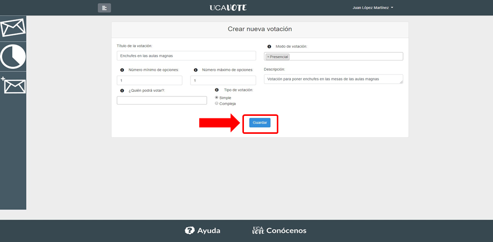
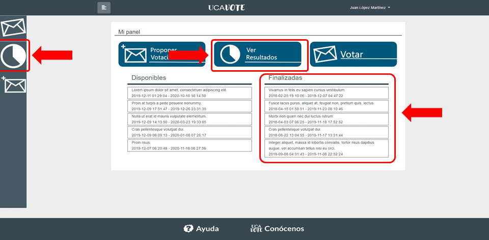
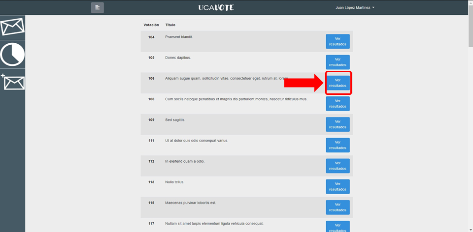
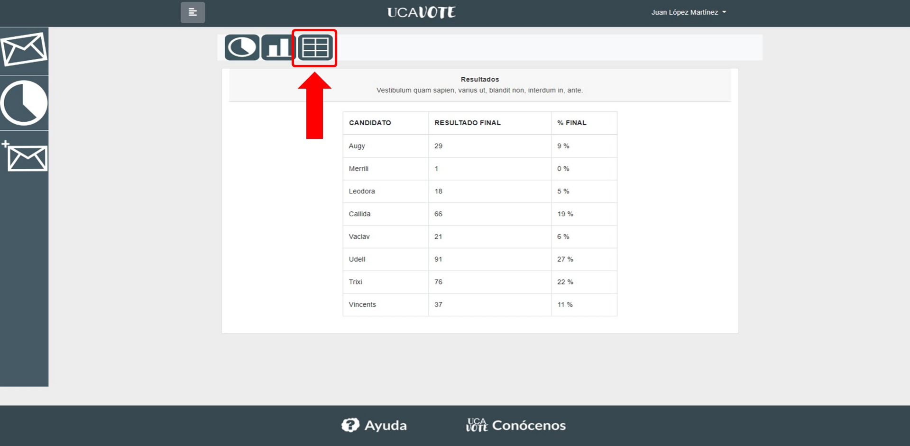
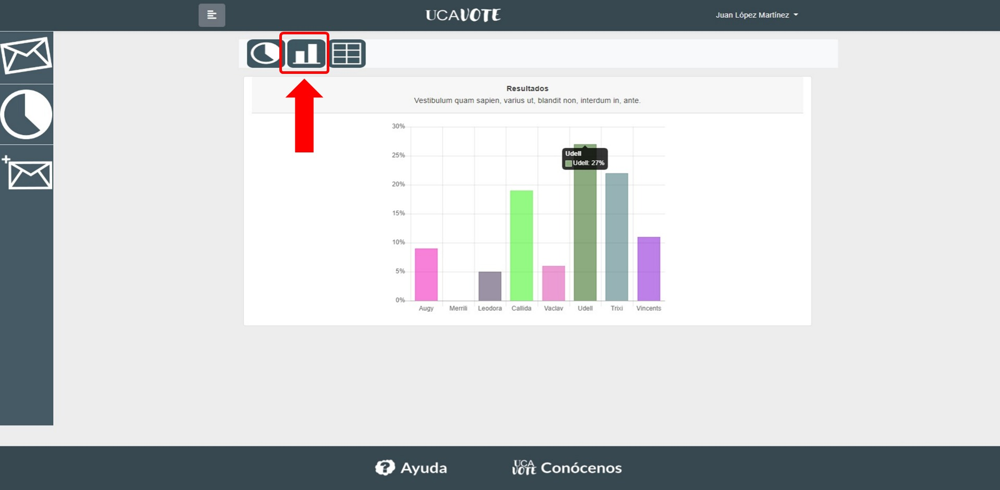
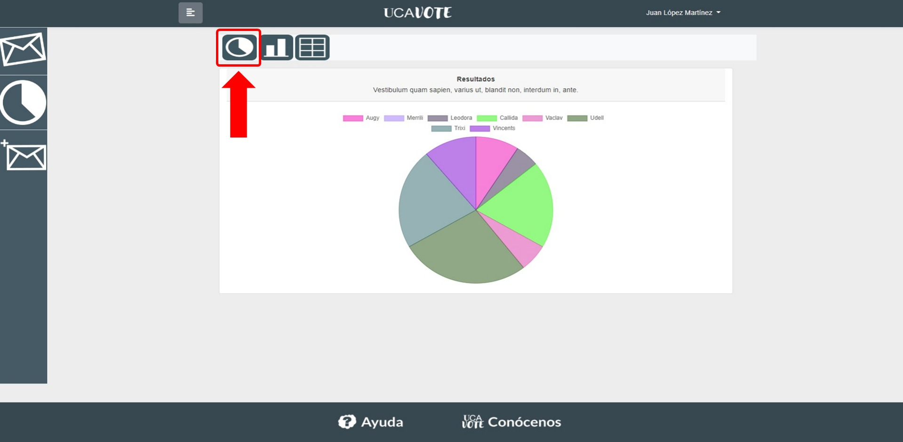
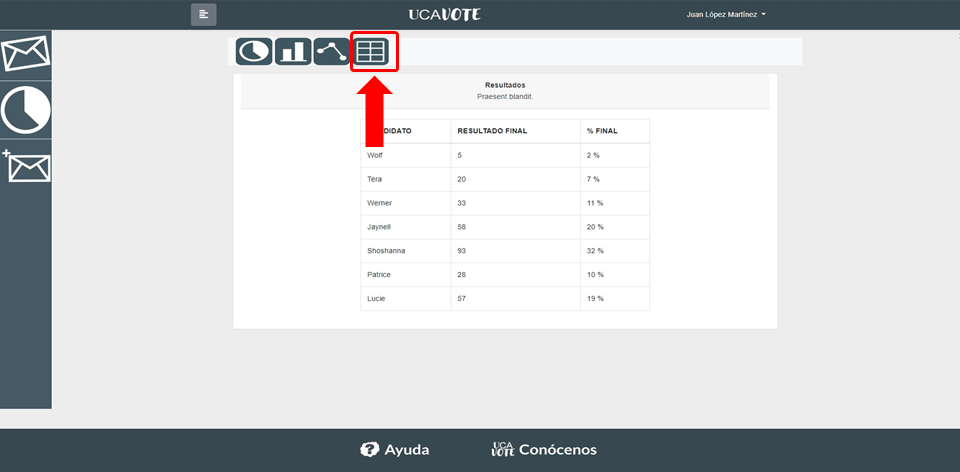

<h1 align="center">USOS DE LA APLICACIÓN</h1>

La aplicación está diseñada con tres funcionalidades principales, las cuales son votar,
proponer una votación y consultar los resultados de alguna votación. En caso de que usted
sea un secretario de mesa, también tendrá la opción de gestionar votaciones propuestas por
los usuarios que propicie su situación concreta. De una forma más detallada, estas
funciones son las siguientes:

## Participar en una Votación
En caso de quiera usted participar en una votación, al acceder a la aplicación, tendrá usted
múltiples caminos para hacerlo.
1. En caso de que la votación/es en las que desea participar figure resaltada en la
página principal, puede acceder a esta haciendo click en su nombre. Estas estarán
situadas en la parte inferior izquierda de la pantalla.

2. Puede seleccionar en la página principal de la aplicación el botón “VOTAR”, el cual le
llevará a una lista de votaciones, las que están disponibles para usted a la hora de
votar. Deberá hacer click en la deseada para acceder al proceso de voto.

3. En cualquier vista dentro de la propia página, podrá hacer click en el icono del sobre
azul (El primero en orden descendente) de la sidebar izquierda, el cual le llevará a la
lista mencionada en la segunda opción para posteriormente seleccionar la votación
en la que desea participar.

Recuerde que el sistema **solo le mostrará las votaciones en las que usted puede votar**,
no todas las votaciones registradas en el sistema. Asimismo, recuerde que **sólo puede
votar una vez por votación**, aunque el sistema le impedirá que lo haga en caso de que la
votación no permita editar el voto una vez emitido.

## Proponer una Votación
En caso de querer proponer una votación en el sistema, podrá hacerlo desde dos caminos
posibles que convergerán a la hora de definir la votación.

1. Puede acceder al proceso haciendo click desde la página principal en el icono
“PROPONER VOTACIÓN”.

2. Puede acceder en cualquier vista de la aplicación a través del icono del sobre azul
con un símbolo más en su esquina superior izquierda (El segundo en orden
descendente) en la sidebar izquierda.

Haya elegido el camino que desee, llegará a una ventana la cual le mostrará un formulario
que deberá rellenar con los datos de la votación que desea proponer. Entre estos campos
figurarán nombre, censo, número de opciones, etc… **Recuerde que la fecha y  hora en la
que se realizará la votación será dispuesta por el secretario que apruebe la
celebración de la misma**, aunque tenga en cuenta que siempre podrá sugerir una fecha y
hora dentro del formulario.

Una vez creada la votación, esta se introducirá en el sistema a la espera de que el
secretario competente la apruebe. **Recuerde que la votación no aparecerá visible hasta
que un secretario la haya validado**.

## Ver Resultados de una Votación
Puede usted acceder a los resultados de una votación una vez esta haya finalizado, o
incluso en el transcurso de esta si la votación así lo permite. Para hacerlo, puede seguir
cualquiera de estos tres pasos:

1. En caso de que la votación cuyos resultados quiere consultar figure en la lista de
“ÚLTIMAS ACABADAS”, puede hacer click en el nombre de la misma en la página
principal.

2. Puede acceder a los resultados de las votaciones haciendo click en “VER
RESULTADOS” en la página principal.

3. Puede acceder a los resultados desde cualquier vista de la página desde el icono del
gráfico circular (El tercero en orden descendente) de la sidebar izquierda.

En caso de haber accedido desde los pasos dos o tres, verá una lista con todas las
votaciones cuyos resultados puede consultar. **Recuerde que puede haber votaciones que
no hayan acabado en esta lista, en caso de que permitan visualizar los resultados en
tiempo real**. Haga click en el nombre de la votación cuyos resultados desee consultar.

Una vez haya hecho esto, dispondrá de un gráfico circular con los resultados de la votación,
así como una leyenda que le detallará qué color o parte del gráfico corresponde con cada
opción de la votación. En caso de que el gráfico circular no sea de su agrado, dispondrá en
la parte izquierda de la pantalla los distintos modos de visualización de resultados
implementados en la aplicación. Estos son, además del gráfico circular, una gráfica de
barras y una gráfica de puntos. Podrá alternar entre los distintos modos haciendo click en
sus distintos iconos.

## Gestionar una Votación
En caso de que sea usted un secretario de mesa, además de las funcionalidades anteriores,
podrá acceder a la de gestionar votaciones. Para desempeñar su función, deberá acceder al
menú de gestión de votaciones. Podrá hacerlo de dos formas distintas:

1. Haciendo click en el icono “GESTIONAR VOTACIONES” en la página principal.

2. Haciendo click en el icono de los cuatro sobres (Para usted, 4 icono en orden
descendente) en la sidebar izquierda.

**Recuerde que en caso de que usted no sea Secretario, no tendrá acceso a este menú
ni verá los iconos dispuestos para realizar estas tareas**.

Una vez hecho esto, verá una lista de votaciones por aprobar. Haciendo click en cualquiera
de ellas, podrá ver de forma detallada las opciones solicitadas por su autor, título, opciones,
censo, etc. En caso de que la considere digna de aprobación, el sistema le solicitará que
ingrese una fecha y hora, tanto de inicio como de final para la votación. **Recuerde que es
usted quien debe decidir la hora y fecha para el transcurso de la votación**.

Una vez hecho esto, la votación estará registrada en el sistema.

[Link](https://ejemplo.com/ "Título opcional del enlace")
Hola
