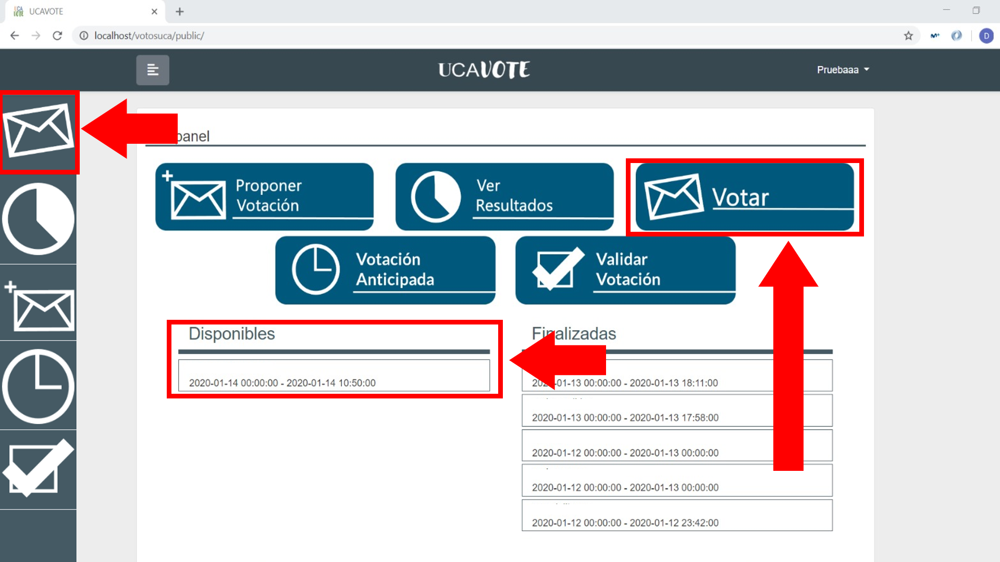

<h1 align="center">USOS DE LA APLICACIÓN</h1>

La aplicación está diseñada con tres funcionalidades principales, las cuales son votar,
proponer una votación y consultar los resultados de alguna votación. En caso de que usted
sea un secretario de mesa, también tendrá la opción de gestionar votaciones propuestas por
los usuarios que propicie su situación concreta. De una forma más detallada, estas
funciones son las siguientes:

## Participar en una Votación
Una vez se loguee en el sistema como usuario, verá automáticamente una lista con todas las
votaciones actualmente disponibles en las que puede votar. En caso de estar en otra vista, podrá
acceder a dicha función desde el primer icono del sidebar izquierdo, el del sobre.

Recuerde que el sistema **solo le mostrará las votaciones en las que usted puede votar**,
no todas las votaciones registradas en el sistema. Asimismo, recuerde que **sólo puede
votar una vez por votación**, aunque el sistema le impedirá que lo haga en caso de que la
votación no permita editar el voto una vez emitido.

## Proponer una Votación
En caso de querer proponer una votación en el sistema, puede acceder en cualquier vista de la
aplicación a través del icono del sobre azul con un símbolo más en su esquina superior izquierda
(El segundo en orden descendente) en la sidebar izquierda.
Las votaciones pueden ser simples, es decir, las opciones se generan automáticamente (si y no) o
complejas, donde usted elige las opciones que se ajusten a su pregunta. Además, si tiene permisos
de secretarios, podrá rellenar campos relacionados con la gestión de la encuesta, como pueden
ser las ponderaciones, el quorum o las fechas de fin e inicio. Pase el ratón sobre el icono de
información para conocer la función de cada campo.
Cuando haya terminado de crear su encuesta, haga click en Guardar. Si usted no tiene permiso de
secretarios, tendrá que esperar a que un secretario acepte su propuesta.

## Ver Resultados de una Votación
Puede usted acceder a los resultados de una votación una vez esta haya finalizado. Para hacerlo,
puede acceder a los resultados desde cualquier vista de la página desde el icono del gráfico
circular (El tercero en orden descendente) de la sidebar izquierda.
A continuación, deberá seleccionar la votación cuyos resultados desee ver desde el menú que se le
mostrará en pantalla
Ahora, dispondrá de una tabla con los resultados de la votación. En caso de que la tabla no sea de
su agrado, dispondrá en la parte izquierda de la pantalla los distintos modos de visualización de
resultados implementados en la aplicación. Estos son, además de la tabla una gráfica de barras y
un gráfico circular. Podrá alternar entre los distintos modos haciendo click en sus distintos iconos.

## Gestionar una Votación
En caso de que sea usted un secretario de mesa, además de las funcionalidades anteriores,
podrá acceder a la de gestionar votaciones. Para desempeñar su función, deberá acceder al
menú de gestión de votaciones. Podrá hacerlo de dos formas distintas:

1. Haciendo click en el icono “GESTIONAR VOTACIONES” en la página principal.

2. Haciendo click en el icono de los cuatro sobres (Para usted, 4 icono en orden
descendente) en la sidebar izquierda.

Una vez hecho esto, verá una lista de votaciones por aprobar. Haciendo click en cualquiera de
ellas, podrá ver de forma detallada las opciones solicitadas por su autor, título, opciones, censo,
etc. En caso de que la considere digna de aprobación, el sistema le solicitará que ingrese datos
tales como la fecha y hora de inicio, el quorum, ponderaciones… Pase el ratón sobre el icono de
información para conocer la función de cada campo.
Cuando haya terminado, haga click en Guardar.

Una vez hecho esto, la votación estará registrada en el sistema.

## Validar una Votación
En caso de que una votación haya sido creada por un secretario, es necesario que esta sea
validada antes de que los resultados se hagan públicos. Si usted ha sido elegido presidente de
mesa o representante de uno de los electos en una votación compleja, podrá validar dicha
votación desde cualquier vista de la página desde el icono de la caja marcada (El quinto en orden
descendente) de la sidebar izquierda.
A continuación, se le mostrarán los resultados de la encuesta, y podrá elegir si los considera
válidos o no. Guarde su elección haciendo click en Guardar. Si la ha validado, los resultados se
harán públicos para todos los usuarios

## Votación anticipada
En caso de que una votación haya sido determinada como anticipada, podrá solicitar votar en ella
antes de que se abra su plazo real. Puede acceder a esta opción desde cualquier vista de la página
desde el icono del reloj (El cuarto en orden descendente) de la sidebar izquierda.
Si es usuario, podrá enviar una solicitud para votar de forma anticipada. Para ello, elija la votación
en la que desea votar anticipadamente e introduzca el motivo. Acto seguido, haga click en guardar
para enviar tu solicitud a los secretarios.
Si es secretario, podrá aceptar o denegar dichas solicitudes. Para ello, elija una votación y,
después, una solicitud. Dentro de la misma, lea el motivo, seleccione Aceptar o Rechazar según su
criterio y haga click en Guardar. Una vez un secretario haya validado la solicitud de un usuario,
este podrá votar dentro del plazo establecido para la votación anticipada, desde el botón de Votar.

## Modificar plazos
Si usted es secretario y no está conforme con los plazos de voto establecidos para una votación,
puede modificarlos desde uno de estos dos caminos:
1. Puede acceder haciendo click en “MODIFICAR PLAZOS” en la página principal.
2. Puede acceder desde cualquier vista de la página desde el icono del lápiz (El quinto en
orden descendente) de la sidebar izquierda.
A continuación, seleccione la votación en la que quiere cambiar los plazos, introduzca los nuevos
plazos y haga click en Guardar para registrar los cambios.

<a href="https://ucavote.000webhostapp.com/"> Volver a UCAVOTE</a>
