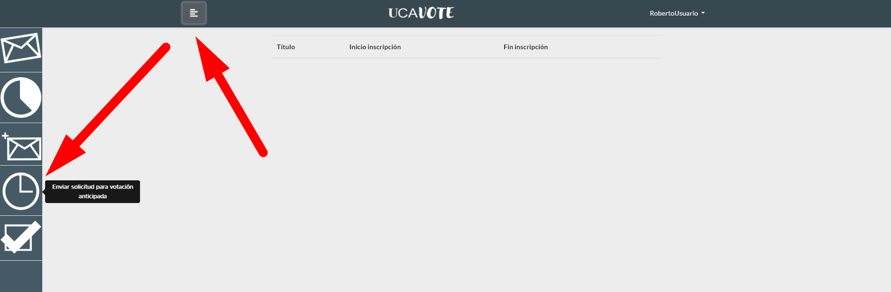

<h1 align="center">USOS DE LA APLICACIÓN</h1>

La aplicación divide a los usuarios dados de alta en Usuarios y Secretarios, los cuales tendrán acceso a un número de funcionalidades exclusivas. Los usuarios podrán votar y, en el caso de ser elegidos presidentes de mesa, validar votaciones. Mientras que los secretarios podrán gestionar votaciones y modificar los plazos de las mismas. Además, hay funciones comunes a todos los usuarios como puede ser proponer votaciones o ver resultados de las mismas. Las funciones principales de la aplicación se detallan en los siguientes puntos:

## Participar en una Votación
Si usted es Usuario, nada más loguearse en el sistema, verá una pantalla donde puede seleccionar una de las votaciones actualmente abiertas para participar en la misma.

 

Además, desde cualquier vista de la aplicación, podrá mostrar el menú desplegable de la izquierda y hacer click en el icono del sobre (el primero desde arriba) para acceder a esta lista de votaciones actualmente disponible.

 

Recuerde que el sistema sólo le mostrará las votaciones en las que usted puede votar, y que los Secretarios no tienen acceso a esta función. Cuando haya elegido la votación en la que desea participar, simplemente marque la o las opciones que vea convenientes bajo su criterio (el número mínimo y máximo se especifica en la parte superior de la página) y haga click en Enviar votación

Recuerde que excederse del máximo de opciones o no llegar al mínimo de opciones se considera voto nulo, y si no marca ninguna opción, se considera voto en blanco.

## Proponer una Votación
Si quiere proponer una votación en el sistema, puede seleccionar el icono del sobre con un símbolo de suma en la barra lateral izquierda. Cuando lo haga, se le mostrará un menú con todas las votaciones que usted ha propuesto y si han sido o no aceptadas por un Secretario. Haga clic en Crear nueva votación, en la parte izquierda de la página, para poder proponer una nueva votación.

  

Además, si usted es Secretario, también puede acceder a esta vista desde el menú principal, haciendo clic en el botón correspondiente.

  

UCAVote divide las votaciones en simples y complejas. Por defecto, la opción marcada es Simple, que consta de los siguientes campos:

Las opciones en el caso de una votación simple siempre serán Si y No, dando posibilidad a voto nulo o en blanco. Sin embargo, al seleccionar votación compleja, podremos añadir más opciones, recogidas en una lista modificable por los Secretarios, a nuestra encuesta.

Cuando haya rellenado todos los campos, haga clic en Guardar. Tenga en cuenta que su propuesta debe ser aceptada por un Secretario.
Si usted es Secretario, sin embargo, podrá rellenar campos adicionales no disponibles para los Usuarios a la hora de proponer una votación

-	Quorum: Mínimo de votos para que la votación se considere válida
-	Modo de votación:
    -	Presencial: La votación se hace cuando los votantes estén presentes
    -	Anticipada: El usuario puede inscribirse en la votación con antelación.
    -	Rectificable: El usuario puede modificar su voto
Además, podrá definir los plazos de inicio y fin de la votación. Si la ha marcado como Anticipada, puede definir los plazos de inscripción anticipada a la misma y, si ha elegido qué grupos pueden votar, también podrá decidir las ponderaciones de los mismos sobre el voto.

Si es Secretario y elige votación compleja, también se habilitarán más campos:

Además de elegir entre las opciones de la lista como los Usuarios, también podrá definir opciones nuevas. Finalmente, debe elegir a un representante (usuario del sistema) por cada opción. Cuando haya terminado, haga click en Guardar y, si es Secretario, su votación será automáticamente aceptada.

## Ver Resultados de una Votación
Tanto si es Usuario como Secretario, puede conocer los resultados de una votación siempre y cuando esté ya finalizada. Para ello, haga clic desde cualquier vista en el botón del gráfico circular en la barra desplegable izquierda (el segundo desde arriba) para acceder a un listado con todas las votaciones ya finalizadas.

  

A continuación, haga click en la votación que quiera conocer sus resultados, pero recuerde que no tendrá acceso a los resultados si esta no está validada.
Además, si usted es Secretario, también podrá acceder a la misma vista haciendo click en el botón de Ver Resultados desde el menú principal de la aplicación.

  

Una vez tenga delante los resultados de una votación, los verá en forma de tabla, pero también puede cambiar a un gráfico de barras o circular usando los tres botones de la barra de arriba.

  
  
  

## Gestionar una Votación
Esta función es exclusiva para los Secretarios de la aplicación, y les permite aceptar o rechazar votaciones propuestas por los Usuarios. Podrá acceder a esta función o bien desde el botón de Gestionar Votaciones en el menú principal, o bien desde el icono de los tres sobres en la barra desplegable izquierda (el del medio):

 

Ahora accederá a un listado con todas las votaciones a gestionar. Seleccione una de ellas y se le mostrará una vista como la siguiente:

 

Se muestran todos los datos introducidos por el usuario para que usted pueda decidir si dicha votación merece o no ser aceptada. En el caso de que la rechace, simplemente haga clic en Guardar, pero si decide aceptarla, deberá rellenar ciertos campos adicionales:

 

Estos campos son idénticos a los que, como Secretario, puede rellenar mientras crea una votación:
-	Quorum: Mínimo de votos para que la votación se considere válida
-	Modo de votación:
    - Presencial: La votación se hace cuando los votantes estén presentes
    - Anticipada: El usuario puede inscribirse en la votación con antelación.
    - Rectificable: El usuario puede modificar su voto
Además, podrá definir los plazos de inicio y fin de la votación. Si la ha marcado como Anticipada, puede definir los plazos de inscripción anticipada a la misma y, si el Usuario ha elegido qué grupos pueden votar, también podrá decidir las ponderaciones de los mismos sobre el voto.
Cuando haya finalizado de rellenar los campos, haga clic en Guardar.

## Validar una Votación
Cuando se registra una nueva votación en el sistema, este elige un presidente de mesa de entre todos los Usuarios de forma aleatoria. La función de este es decidir si los resultados de una votación son o no válidos. Puede acceder a la lista de votaciones para las que es presidente de mesa desde el icono de la caja marcada en la barra desplegable izquierda (el último desde arriba):
 
 

Una vez decidida la votación, acéptala o rechácela, y luego haga clic en Guardar.

   

## Votación anticipada
Esta función está disponible para Usuarios y Secretarios, pero en ambos casos su comportamiento es diferente. Si es Usuario, puede acceder a esta función desde el icono del reloj en la barra desplegable izquierda (el penúltimo desde arriba)

Si existen votaciones en las que puede inscribirse de forma anticipada, se le mostrarán. Una vez elija una, escriba el motivo por el cual desea votar de forma anticipada y haga clic en Guardar. A continuación, un Secretario deberá juzgar si su motivo es válido o no para que pueda votar con antelación.

  

Si es usted un Secretario, puede acceder también a este caso de uso desde el botón de Votación Anticipada en el menú principal de UCAVote.

  

A continuación, elija una votación y, luego, una de las peticiones de votación anticipada. Se mostrará la votación junto a los motivos del Usuario. Decida si acepta o no acepta que este usuario pueda votar anticipadamente y haga clic en Guardar.

 

## Modificar plazos
Esta función sólo está disponible a los Secretarios de la aplicación. Para acceder a ella, haga clic en el botón de Modificar Plazos en el menú principal o en el icono del lápiz en la barra desplegable izquierda (el último desde arriba):

A continuación, se le mostrará una lista de aquellas votaciones que no hayan finalizado aún (incluso si ni siquiera han empezado), lo que quiere decir que puede modificar los plazos de la misma, pero debe tener en cuenta que todos los usuarios que formen parte del censo de la misma serán notificados e informados del cambio.
Seleccione la que desee, revise los plazos y cámbielos a su gusto, y cuando haya terminado haga clic en el botón de Guardar.

  

<a href="https://ucavote.000webhostapp.com/"> Volver a UCAVOTE</a>
